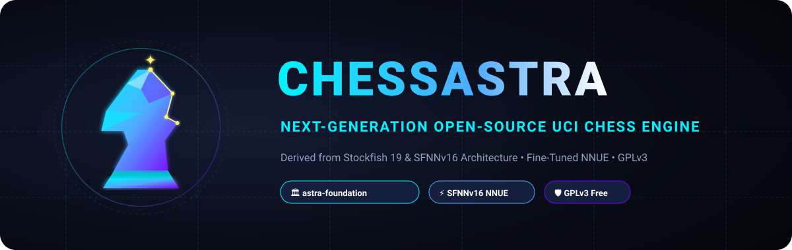

<p align="center">
  
</p>

<p align="center">
  <a href="https://github.com/astra-foundation/ChessAstra/actions/workflows/ci.yml"></a>
  <a href="LICENSE"></a>
  <a href="https://github.com/astra-foundation"></a>
  <a href="docs/NETWORKS.md"></a>
</p>

---

ChessAstra is a high-performance open-source UCI chess engine derivative of Stockfish, maintained under the [**Astra Foundation**](https://github.com/astra-foundation). It is designed to measurably outperform baseline Stockfish 19 through refined NNUE fine-tuning, automated data filtering pipelines, and specialized search heuristics.

> **Derivative Work Notice:**
> ChessAstra is a derivative work based on Stockfish and its NNUE networks, licensed under GPLv3.
> Forked from official Stockfish 19 release tag `sf_19` (commit `edb0d9db6731067ec50ce619ff372b463bc4dd5d`).
> All code, training pipelines, and networks remain free and open source under GNU General Public License v3.

---

## Key Features & Goals

- **State-of-the-Art Architecture:** SFNNv16 NNUE architecture (HalfKAv2_hm + FullThreats + PP_3Wide, L1=1024, L2=32, L3=32, 8 layer stacks).
- **Data-Driven NNUE Evolution:** Iterative fine-tuning using `nnue-pytorch` on high-quality filtered self-play, diverse tactical positions, and endgame data.
- **Rigorous Verification:** Strict SPRT testing (Sequential Probability Ratio Test, $H_0: \text{Elo}=0, H_1: \text{Elo}=+3$) with pentanomial model analysis across standard STC (10s + 0.1s) and LTC (60s + 0.6s) with balanced 8-move UHO opening books.
- **Cross-Platform & SIMD Optimized:** Full support for `x86-64-avx512`, `x86-64-vnni512`, `x86-64-avx2`, `x86-64-bmi2`, `x86-64-modern` (SSE4.1/POPCNT), and `armv8-neon` / Apple Silicon.

---

## Repository Structure

```
ChessAstra/
├── src/                # Engine source code in C++20
│   ├── Makefile        # High-performance multi-target build system
│   ├── nnue/           # NNUE neural network forward pass implementation
│   ├── syzygy/         # Syzygy endgame tablebase probing
│   └── ...
├── networks/           # Trained and quantized .nnue neural network files
├── training/           # NNUE training configs, datasets, and scripts
│   ├── config.yaml     # Fine-tuning hyperparameters & LR schedule
│   └── data_filter.py  # Self-play and tactical filtering pipeline
├── tests/              # SPRT testing framework, opening books, gauntlets
│   ├── books/          # Balanced 8-move UHO opening books (EPD/PGN)
│   ├── sprt/           # Fastchess SPRT runner & pentanomial analyzer
│   └── signature.sh    # Bench determinism test
├── docs/               # Research notes, training logs, match results
├── AUTHORS             # Authors and contributors
├── Copying.txt         # GNU General Public License v3
├── LICENSE             # GPLv3 License
└── NOTICE              # Legal and derivative notice
```

---

## Building ChessAstra

### Prerequisites
- Modern C++ compiler supporting C++20 (`g++ >= 11`, `clang++ >= 13`, or MSVC 2022)
- GNU Make

### Quick Build (Native CPU Optimization)
```bash
cd src
make -j ARCH=native build
```

### Profile-Guided Optimization (PGO) Build (Highest Performance)
```bash
cd src
make -j ARCH=x86-64-avx2 profile-build
```

### Specific Architecture Targets
- **AVX-512 with VNNI:** `make -j ARCH=x86-64-vnni512 build`
- **AVX-512:** `make -j ARCH=x86-64-avx512 build`
- **AVX-2 / BMI2:** `make -j ARCH=x86-64-avx2 build`
- **SSE4.1 / POPCNT:** `make -j ARCH=x86-64-sse41-popcnt build`
- **ARM64 / Apple Silicon:** `make -j ARCH=armv8-dotprod build` or `ARCH=apple-silicon`

---

## Benchmarking & Verification

Verify engine integrity and node parity using the built-in benchmark:
```bash
./src/chessastra bench
```

Run automated SPRT testing against baseline Stockfish:
```bash
python3 tests/sprt/run_sprt.py --engine1 ./src/chessastra --engine2 ./baseline/stockfish --tc 10+0.1 --book tests/books/UHO_Lichess_4852_v1.epd
```

---

## License & Attribution

ChessAstra is free software licensed under the **GNU General Public License version 3** (GPLv3).
See [`Copying.txt`](Copying.txt) or [`LICENSE`](LICENSE) for complete license terms.

Original Stockfish copyright: Copyright (C) 2004-2026 The Stockfish developers.
ChessAstra modifications copyright: Copyright (C) 2026 ChessAstra developers.
